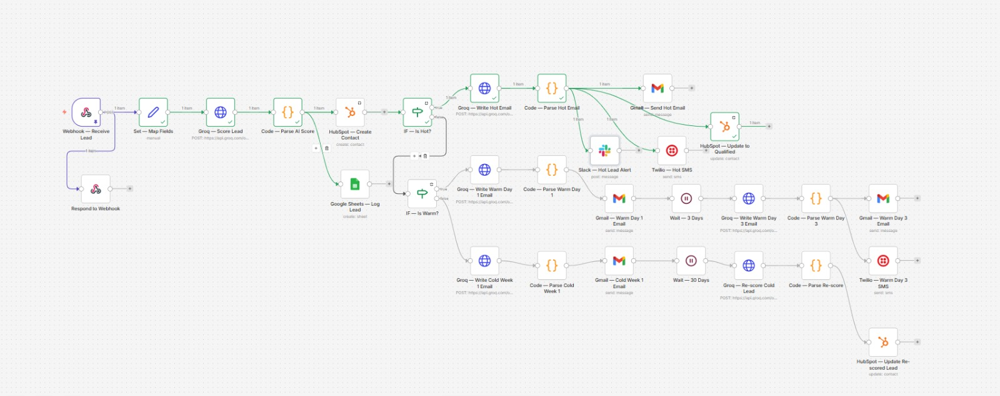

<div align="center">

# AI-Powered CRM Lead Automation Suite

**An end-to-end lead nurturing pipeline that captures, scores, and routes leads into tiered multi-channel follow-up sequences — with zero manual triage.**

[](https://n8n.io)
[](https://groq.com)
[](https://hubspot.com)
[](https://gmail.com)
[](https://twilio.com)
[](https://slack.com)
[](https://sheets.google.com)

[-blue?style=flat-square)](#what-it-does)
[](#what-it-does)
[](#)

</div>

---

Built in **n8n**, this suite uses **Groq (Llama 3.3 70B)** to qualify leads and write personalized outreach, **HubSpot** as the CRM of record, and **Gmail / Twilio / Slack** as delivery channels — so leads get the right message, on the right channel, at the right time, automatically.



---

## Why This Exists

Most "lead capture" demos stop at "save form submission to a spreadsheet." This project goes further: it simulates what a real sales-ops stack does after a lead arrives — qualify it, decide how urgent it is, and run a different playbook depending on the answer. That's the actual hard part of CRM automation, and it's what this workflow is built around.

---

## What It Does

1. **Captures** a lead from any form or site via webhook (name, email, phone, company, message, source).
2. **Scores** the lead using an LLM prompted to act as a sales-qualification analyst — returning a structured score (`Hot` / `Warm` / `Cold`), priority, buying intent, reasoning, and a suggested approach.
3. **Logs** every lead to HubSpot (as a contact) and Google Sheets (as an audit trail), regardless of score.
4. **Branches** into one of three nurture tracks based on the AI's verdict:

| Tier | Behavior |
|---|---|
| 🔥 **Hot** | AI writes a direct, enthusiastic first-contact email → sent via Gmail. Sales is alerted instantly via **Slack** and the lead is texted via **Twilio SMS**. HubSpot contact is updated to *Qualified*. |
| 🌤️ **Warm** | AI writes a Day 1 email → 3-day wait → AI writes a Day 3 follow-up email **and** SMS, automatically adapting tone for a second touch. |
| ❄️ **Cold** | AI writes a low-pressure Week 1 email → 30-day wait → lead is **automatically re-scored** by the AI based on any new signals, and HubSpot is updated with the revised verdict — so cold leads don't get forgotten, they get a second look. |

Every email is generated fresh by the LLM per-lead — nothing is a static template. The system also includes input validation and fallback handling so a malformed AI response never breaks the pipeline.

---

## Architecture

```
Webhook (lead in)
   │
   ▼
Map Fields → Groq: Score Lead → Parse AI Score
   │                                  │
   │                    ┌─────────────┼─────────────┐
   ▼                    ▼             ▼             ▼
HubSpot (create)   Google Sheets   IF: Hot?      IF: Warm?
                      (log)            │             │
                                 ┌──────┘      ┌──────┘
                                 ▼             ▼
                          Hot Email      Warm Day 1 Email
                          → Gmail        → Gmail
                          → Twilio SMS   → Wait 3 Days
                          → Slack alert  → Warm Day 3 Email
                          → HubSpot      → Gmail + Twilio SMS
                            (Qualified)
                                              Cold Week 1 Email
                                              → Gmail
                                              → Wait 30 Days
                                              → AI Re-score
                                              → HubSpot (update)
```

---

## Tech Stack

[](https://n8n.io)
[](https://groq.com)
[](https://hubspot.com)
[](https://gmail.com)
[](https://twilio.com)
[](https://slack.com)
[](https://sheets.google.com)

**Logic:** native n8n `IF`, `Wait`, and `Code` (JavaScript) nodes for parsing and validation

---

## Why These Design Choices

**LLM does qualification, not just generation.** Scoring uses a structured-JSON prompt rather than a vague ask — this makes the output reliably routable by downstream `IF` nodes instead of requiring another parsing layer.

**Fallback parsing on every AI call.** Each `Code` node that consumes an LLM response strips markdown fences and wraps the JSON parse in a try/catch with a sane default (e.g., defaults to `Warm` priority 5 if the AI response is malformed) — so a single bad model response can't break the pipeline or leave a lead unprocessed.

**Tiered timing, not one-size-fits-all.** Hot leads get same-second, multi-channel treatment; warm leads get a spaced two-touch sequence; cold leads get a long-tail re-engagement and re-score instead of being dropped — mirroring how a real SDR team would triage.

**Audit trail independent of CRM.** Every lead is logged to Google Sheets in parallel with HubSpot, so there's a plain, queryable record even if a CRM write fails or HubSpot fields change.

---

## Setup

1. Import `CRM_Automation_Suite.json` into your n8n instance.
2. Connect credentials for: Groq (HTTP Header Auth), HubSpot, Gmail, Twilio, Slack, Google Sheets.
3. Point your lead-capture form (or any service) at the webhook URL, POSTing:

```json
{
  "name": "Jane Doe",
  "email": "jane@example.com",
  "phone": "+1234567890",
  "company": "Example Co",
  "message": "Looking for a CRM automation solution for our 50-person sales team",
  "source": "website-contact-form"
}
```

4. Activate the workflow.

> ⚠️ This repo ships with the workflow **logic** only. Credentials, API keys, and your HubSpot/Sheet IDs are not included — you'll need your own accounts for each integration.

---

## Engineering Notes

- The AI scoring prompt enforces a strict JSON-only response format to keep parsing deterministic.
- All downstream `Code` nodes reference upstream node data explicitly (e.g. `$('Set — Map Fields').first().json`) rather than relying on implicit `$json`, so the flow stays correct even as more branches are added.
- Wait nodes (3-day, 30-day) are native n8n delays — in production these would typically be swapped for a scheduled/queued re-trigger to avoid tying up a workflow execution slot for 30 days, depending on your n8n hosting plan.

---

## Potential Extensions

- Add a "Replied" webhook listener to halt a sequence early if the lead responds.
- Swap static delays for a CRM-property-driven re-trigger (cron-checked) for better scalability.
- A/B test AI-generated subject lines via HubSpot engagement data fed back into the scoring prompt.

---

<div align="center">

**Author:** [Muhammad Hannan Faisal](https://github.com/m-hannanfaisal)

[](mailto:hannanfaisal0507@gmail.com)

Specializing in: n8n workflow automation · LLM integrations · CRM pipelines · AI-powered lead systems

</div>
